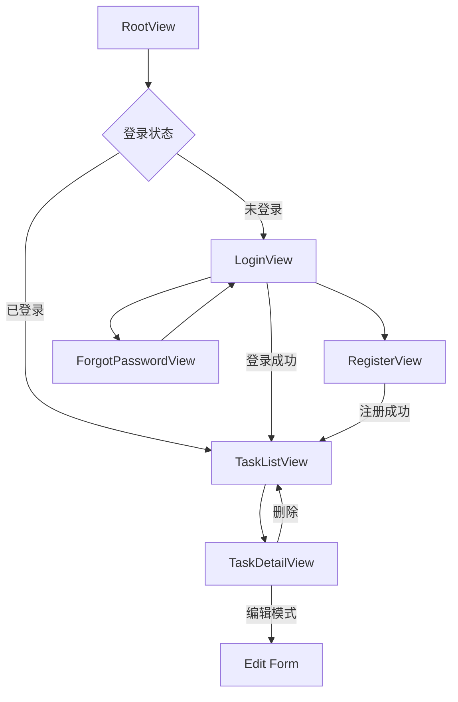

# iOS任务管理应用 - 项目分析报告

## 📱 项目概览

**应用名称**：task-app-ios  
**开发语言**：Swift  
**UI框架**：SwiftUI  
**数据持久化**：SwiftData  
**最低版本**：iOS 17+  
**开发状态**：核心功能已完成  

## 🏗️ 架构设计

### 分层架构
```
task-app-ios/
├── App/                    # 应用配置层
│   └── DependencyInjection.swift
├── Domain/                 # 领域层
│   ├── Entities/           # 数据模型
│   │   ├── Task.swift
│   │   └── User.swift
│   └── Repositories/       # 仓储接口
│       ├── TaskRepository.swift
│       └── UserRepository.swift
├── Data/                   # 数据访问层
│   └── Repositories/       # 仓储实现
│       ├── SwiftDataTaskRepository.swift
│       └── SwiftDataUserRepository.swift
├── Presentation/           # 表现层
│   ├── Views/              # 视图
│   ├── ViewModels/         # 视图模型
│   └── Components/         # 共享组件
└── Helpers/                # 工具类
    └── SecurityHelpers.swift
```

### 设计模式
- **Repository Pattern**：抽象数据访问层
- **MVVM Pattern**：视图与业务逻辑分离
- **Dependency Injection**：依赖注入容器管理
- **Singleton Pattern**：DependencyContainer单例

## ✅ 核心功能完成情况

### 1. 用户认证系统
- ✅ **用户注册**：用户名、邮箱、密码验证
- ✅ **用户登录**：凭证验证与状态管理
- ✅ **忘记密码**：邮箱验证与重置流程
- ✅ **记住我功能**：钥匙串安全存储
- ✅ **密码安全**：SHA-256哈希加密

### 2. 任务管理系统
- ✅ **创建任务**：标题、详情、截止日期
- ✅ **查看任务**：任务列表与详情展示
- ✅ **编辑任务**：修改任务信息
- ✅ **删除任务**：单个任务删除
- ✅ **状态管理**：完成/未完成切换

### 3. 数据持久化
- ✅ **SwiftData集成**：@Model宏自动持久化
- ✅ **数据模型**：Task和User实体
- ✅ **关系管理**：用户与任务关联
- ✅ **查询接口**：@Query装饰器

## 📄 页面完成情况 (6个页面)

### 主要页面

| 页面 | 状态 | 功能描述 |
|------|------|----------|
| **RootView** | ✅ 完成 | 根视图，登录状态判断 |
| **LoginView** | ✅ 完成 | 登录界面，包含社交登录占位 |
| **RegisterView** | ✅ 完成 | 用户注册，表单验证完整 |
| **ForgotPasswordView** | ✅ 完成 | 忘记密码，邮箱验证 |
| **TaskListView** | ✅ 完成 | 任务列表，CRUD操作 |
| **TaskDetailView** | ✅ 完成 | 任务详情，编辑模式 |

### UI组件库

| 组件文件 | 状态 | 功能描述 |
|----------|------|----------|
| **SharedComponents** | ✅ 完成 | 共享UI组件库（LoginTextField、按钮样式等） |

### 页面导航流程


## 📊 数据模型

### Task 实体
```swift
@Model
final class Task {
    var title: String           // 任务标题
    var detail: String?         // 任务详情
    var isCompleted: Bool       // 完成状态
    var dueDate: Date?          // 截止日期
    var createdAt: Date         // 创建时间
}
```

### User 实体
```swift
@Model
final class User {
    var username: String        // 用户名
    var password: String        // 密码哈希值
    var email: String?          // 邮箱地址
    var isLoggedIn: Bool        // 登录状态
    var lastLoginDate: Date?    // 最后登录时间
}
```

## 🔐 安全特性

### 密码安全
- **哈希算法**：SHA-256加密存储
- **验证机制**：密码匹配验证
- **安全工具类**：SecurityHelpers统一管理

### 凭证存储
- **钥匙串集成**：使用iOS Keychain Services
- **安全存储**：用户名、密码安全保存
- **自动清理**：退出时清除敏感数据

### 输入验证
- **邮箱格式**：正则表达式验证
- **密码强度**：最少6位字符要求
- **表单验证**：实时输入检查

## 🎯 技术亮点

### SwiftUI现代化设计
- **声明式UI**：响应式界面更新
- **自定义组件**：可复用UI元素
- **导航系统**：NavigationStack/NavigationLink
- **表单处理**：@FocusState键盘管理

### SwiftData数据层
- **现代ORM**：替代CoreData的新方案
- **自动持久化**：@Model宏简化数据模型
- **类型安全**：编译时检查
- **查询语法**：@Query装饰器

### 架构优势
- **清晰分层**：Domain-Data-Presentation分离
- **依赖注入**：便于单元测试
- **仓储模式**：数据访问抽象化
- **MVVM模式**：业务逻辑与UI分离

## 🚀 项目优势

1. **架构清晰**：符合iOS开发最佳实践
2. **代码质量高**：使用Swift现代语法特性
3. **安全性强**：密码加密、钥匙串存储
4. **用户体验佳**：流畅的界面交互
5. **可扩展性好**：依赖注入便于功能扩展
6. **技术前沿**：采用最新SwiftUI/SwiftData技术栈

## 🔧 待优化项

### 功能扩展
- [ ] **任务分类**：添加任务分组功能
- [ ] **搜索筛选**：任务搜索与过滤
- [ ] **批量操作**：批量删除/标记任务
- [ ] **任务统计**：完成率统计视图
- [ ] **推送提醒**：任务到期通知

### 用户体验
- [ ] **设置页面**：用户个人资料管理
- [ ] **主题切换**：深色/浅色模式
- [ ] **多语言**：国际化支持
- [ ] **无障碍**：VoiceOver支持

### 技术优化
- [ ] **网络同步**：云端数据同步
- [ ] **数据备份**：导入/导出功能
- [ ] **性能优化**：大量数据处理
- [ ] **错误处理**：更完善的异常处理机制

## 📈 开发进度

**整体完成度**：85%

| 模块 | 完成度 | 备注 |
|------|--------|------|
| 基础架构 | 100% | 完整的分层架构 |
| 数据模型 | 100% | Task、User实体完成 |
| 用户认证 | 100% | 登录、注册、密码重置 |
| 任务管理 | 90% | 核心CRUD完成，缺少高级功能 |
| UI界面 | 90% | 主要页面完成，缺少设置页 |
| 安全特性 | 100% | 密码加密、钥匙串存储 |

## 🎯 下一步开发建议

1. **优先级高**：完善任务筛选和搜索功能
2. **优先级中**：添加用户设置页面
3. **优先级低**：实现数据云同步
4. **长期规划**：多语言和主题支持

---

**文档更新时间**：2025年1月  
**项目状态**：核心功能完成，可投入使用  
**技术栈**：Swift + SwiftUI + SwiftData