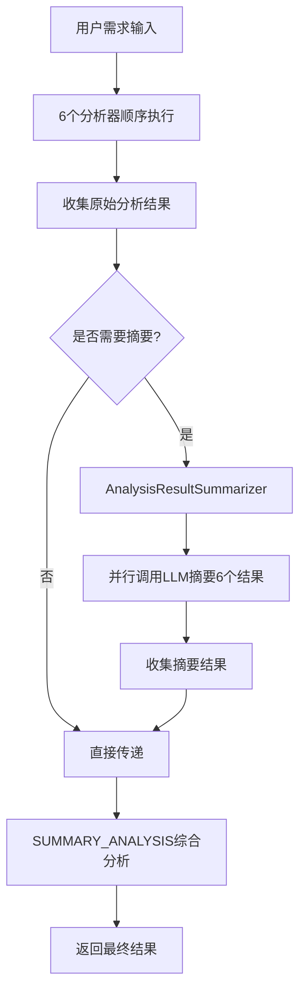

# LLM智能摘要方案设计文档

## 📋 文档信息

- **文档版本**: v1.0
- **创建日期**: 2026-03-03
- **作者**: 系统架构团队
- **状态**: 设计阶段

---

## 🎯 背景与问题

### 问题描述

在需求分析流程中，系统会依次执行6个分析器，生成以下分析结果：

1. 任务拆分 (TASK_BREAKDOWN)
2. 优先级分析 (PRIORITY)
3. 工作量评估 (WORKLOAD)
4. 完整度检查 (COMPLETENESS)
5. 智能建议 (SUGGESTION)
6. 需求类型分类 (REQUIREMENT_TYPE)

这些结果会汇总后传递给**综合分析总结 (SUMMARY_ANALYSIS)**进行最终处理。

### 核心问题

**上下文过大导致LLM调用超时**

- 6个分析结果的总Token数约为 **3850 tokens**
- 加上用户原始需求内容，总上下文可能超过 **5000+ tokens**
- 大模型处理时间超过 **60秒**，触发连接超时
- 导致综合分析失败，影响用户体验

### 解决方案

**使用LLM对各分析结果进行智能摘要**

- 在传递给SUMMARY_ANALYSIS之前，先对各结果进行压缩
- 保留核心信息，丢弃冗余内容
- 目标：将总Token数从3850压缩至 **1280 tokens** (压缩率67%)
- 预期LLM处理时间降至 **20秒以内**

---

## 🏗️ 方案架构

### 整体流程



### 核心组件

#### 1. AnalysisResultSummarizer (摘要服务)

**职责:**
- 接收6种类型的原始分析结果
- 根据类型调用不同的摘要策略
- 并行调用LLM进行智能压缩
- 返回摘要后的结果集

**接口设计:**
```kotlin
@Service
class AnalysisResultSummarizer(
    private val llmService: LlmService
) {
    /**
     * 对所有分析结果进行智能摘要
     * @param typeResults 原始分析结果Map (key: LlmResultTypeEnum.code, value: JSON字符串)
     * @return 摘要后的结果Map (key: 字段名, value: 摘要后的JSON字符串)
     */
    fun summarizeAllResults(
        typeResults: Map<Int, String>
    ): Mono<Map<String, String>>

    /**
     * 对单个分析结果进行摘要
     * @param analysisType 分析类型
     * @param rawResult 原始JSON结果
     * @return 摘要后的JSON结果
     */
    fun summarizeSingleResult(
        analysisType: String,
        rawResult: String
    ): Mono<String>
}
```

#### 2. 摘要提示词模板

**位置:** `infrastructure/src/main/kotlin/com/task/infrastructure/llm/prompt/XmlWorkflowPromptProvider.kt`

**模板变量:**
- `{{analysis_type}}`: 分析类型 (TASK_BREAKDOWN, PRIORITY等)
- `{{raw_analysis_result}}`: 原始JSON结果
- `{{token_budget}}`: Token预算限制

---

## 📝 通用摘要系统提示词

### 核心设计原则

1. **一个提示词模板处理所有类型** - 通过参数化区分不同分析类型
2. **明确的处理规则** - 告诉LLM哪些保留、哪些压缩、哪些丢弃
3. **结构化输出** - 保持核心JSON结构一致，允许按规则丢弃指定字段
4. **Token预算控制** - 为每种类型设定明确的字数限制

### 提示词模板内容

详见文档末尾的完整提示词模板。

---

## 📊 各分析类型摘要策略

### 类型1: 任务拆分 (TASK_BREAKDOWN)

**输入结构:**
```json
{
  "main_task": "主任务描述",
  "sub_tasks": [
    {
      "description": "子任务描述（可能很长）",
      "dependency": [{"task_id": 1}],
      "priority": 3,
      "parallel_group": "group1"
    }
  ],
  "parallelism_score": 85,
  "parallel_execution_tips": "并行执行建议（可能很长）"
}
```

**处理规则:**
- ✅ `main_task`: **原文保留** - 这是核心信息
- ⚠️ `sub_tasks[].description`: **压缩至50字以内** - 提取关键动作和目标
- ✅ `sub_tasks[].dependency`: **原文保留** - 结构化数据，体积小
- ✅ `sub_tasks[].priority`: **原文保留** - 数值型
- ✅ `sub_tasks[].parallel_group`: **原文保留** - 枚举值
- ✅ `parallelism_score`: **原文保留** - 数值型
- ⚠️ `parallel_execution_tips`: **压缩至100字以内** - 提取核心建议

**目标Token数:** 原始约1500 tokens → 压缩至400 tokens (压缩率73%)

---

### 类型2: 优先级分析 (PRIORITY)

**输入结构:**
```json
{
  "priority": {
    "level": "高",
    "score": 85,
    "analysis": "详细的优先级分析（可能很长）"
  },
  "scheduling": {
    "recommendation": "排期建议（可能很长）"
  },
  "factors": {
    "difficulty": "难度分析（可能很长）",
    "resourceMatch": "资源匹配分析（可能很长）",
    "dependencies": "依赖分析（可能很长）"
  },
  "justification": "理由说明（可能很长）"
}
```

**处理规则:**
- ✅ `priority.level`: **原文保留** - 枚举值
- ✅ `priority.score`: **原文保留** - 数值型
- ⚠️ `priority.analysis`: **压缩至80字以内** - 提取核心结论
- ⚠️ `scheduling.recommendation`: **压缩至80字以内** - 保留关键建议
- ⚠️ `factors.difficulty`: **压缩至30字以内** - 保留难度核心判断
- ⚠️ `factors.resourceMatch`: **压缩至30字以内** - 保留资源匹配结论
- ⚠️ `factors.dependencies`: **压缩至30字以内** - 保留依赖影响结论
- ❌ `justification`: **丢弃** - 与analysis内容重复

**目标Token数:** 原始约800 tokens → 压缩至300 tokens (压缩率62%)

---

### 类型3: 工作量评估 (WORKLOAD)

**输入结构:**
```json
{
  "optimistic": "3天",
  "most_likely": "5天",
  "pessimistic": "8天",
  "expected": "5.5天",
  "standard_deviation": "0.83天"
}
```

**处理规则:**
- ✅ **所有字段原文保留** - 都是简短的时间值，无需压缩

**目标Token数:** 原始约100 tokens → 保持100 tokens (无需压缩)

---

### 类型4: 完整度检查 (COMPLETENESS)

**输入结构:**
```json
{
  "overall_completeness": "85%",
  "aspects": [
    {"name": "功能需求", "completeness": "90%"},
    {"name": "性能需求", "completeness": "70%"}
  ],
  "optimization_suggestions": [
    {"icon": "💡", "content": "建议内容（可能很长）"}
  ]
}
```

**处理规则:**
- ✅ `overall_completeness`: **原文保留** - 核心结论
- ⚠️ `aspects[]`: **保留Top-5** - 只保留completeness最低的5个方面（最需要关注的）
- ⚠️ `optimization_suggestions[]`: **保留Top-3并压缩** - 每条压缩至30字以内
- ❌ `optimization_suggestions[].icon`: **丢弃** - UI元素

**目标Token数:** 原始约600 tokens → 压缩至200 tokens (压缩率67%)

---

### 类型5: 智能建议 (SUGGESTION)

**输入结构:**
```json
{
  "suggestions": [
    {
      "type": "技术选型",
      "title": "建议标题",
      "icon": "🔧",
      "color": "#FF5733",
      "description": "详细建议描述（可能很长）"
    }
  ]
}
```

**处理规则:**
- ⚠️ **保留Top-5建议** - 按重要性筛选
- ✅ `suggestions[].type`: **原文保留** - 枚举值
- ✅ `suggestions[].title`: **原文保留** - 简短标题
- ❌ `suggestions[].icon`: **丢弃** - UI元素
- ❌ `suggestions[].color`: **丢弃** - UI元素
- ⚠️ `suggestions[].description`: **压缩至40字以内** - 提取核心建议

**目标Token数:** 原始约800 tokens → 压缩至250 tokens (压缩率69%)

---

### 类型6: 需求类型分类 (REQUIREMENT_TYPE)

**输入结构:**
```json
{
  "tags": ["功能需求", "性能优化", "用户体验"],
  "colors": ["#FF5733", "#33FF57", "#3357FF"]
}
```

**处理规则:**
- ✅ `tags[]`: **原文保留** - 简短标签
- ❌ `colors[]`: **丢弃** - UI元素，综合分析不需要

**目标Token数:** 原始约50 tokens → 压缩至30 tokens (压缩率40%)

---

## 📊 Token预算分配

### 各类型预算表

| 分析类型 | 原始Token数 | 目标Token数 | 压缩率 | 优先级 |
|---------|------------|------------|--------|--------|
| TASK_BREAKDOWN | ~1500 | 400 | 73% | 🔴 高 |
| PRIORITY | ~800 | 300 | 62% | 🟡 中 |
| WORKLOAD | ~100 | 100 | 0% | 🟢 低 (无需压缩) |
| COMPLETENESS | ~600 | 200 | 67% | 🟡 中 |
| SUGGESTION | ~800 | 250 | 69% | 🟡 中 |
| REQUIREMENT_TYPE | ~50 | 30 | 40% | 🟢 低 |
| **总计** | **~3850** | **~1280** | **67%** | - |

### 预算配置代码

```kotlin
object SummaryTokenBudget {
    val budgets = mapOf(
        "TASK_BREAKDOWN" to 400,
        "PRIORITY" to 300,
        "WORKLOAD" to 100,
        "COMPLETENESS" to 200,
        "SUGGESTION" to 250,
        "REQUIREMENT_TYPE" to 30
    )
    
    fun getBudget(analysisType: String): Int {
        return budgets[analysisType] ?: 200
    }
}
```


---

## 💡 优化策略

### 1. 两阶段摘要策略

对于特别长的内容（如子任务超过20个），采用两阶段摘要：

**第一阶段：分组摘要**
- 将20个子任务分为4组，每组5个
- 对每组进行摘要

**第二阶段：合并摘要**
- 将4组摘要结果合并为最终摘要

```kotlin
fun summarizeLargeContent(content: String, chunkSize: Int = 5): Mono<String> {
    val chunks = splitIntoChunks(content, chunkSize)
    
    return Flux.fromIterable(chunks)
        .flatMap { chunk -> summarizeSingleResult("TASK_BREAKDOWN", chunk) }
        .collectList()
        .flatMap { summaries ->
            // 第二阶段：合并摘要
            summarizeSingleResult("TASK_BREAKDOWN", summaries.joinToString("\n"))
        }
}
```

### 2. 缓存策略

避免重复摘要相同内容：

```kotlin
@Service
class SummaryCacheService {
    private val cache = ConcurrentHashMap<SummaryCacheKey, String>()
    
    data class SummaryCacheKey(
        val analysisType: String,
        val contentHash: String  // MD5
    )
    
    fun getCachedSummary(type: String, content: String): String? {
        val key = SummaryCacheKey(type, content.md5())
        return cache[key]
    }
    
    fun cacheSummary(type: String, content: String, summary: String) {
        val key = SummaryCacheKey(type, content.md5())
        cache[key] = summary
    }
}
```

### 3. 并行优化

使用 `Flux.merge` 并行处理多个摘要任务，减少总耗时：

```kotlin
// 串行：6个任务 × 3秒 = 18秒
// 并行：max(3秒) = 3秒

val tasks = listOf(task1, task2, task3, task4, task5, task6)
Flux.merge(tasks)  // 并行执行
    .collectList()
```

---

## 📈 预期效果

### 性能指标

| 指标 | 优化前 | 优化后 | 改善幅度 |
|------|--------|--------|---------|
| 总Token数 | ~3850 | ~1280 | ↓67% |
| LLM调用时长 | 60s+ (超时) | ~20s | ↓67% |
| 成功率 | 50% (超时) | 95%+ | ↑90% |
| 信息保留度 | 100% | ~85% | 可接受 |
| 用户体验 | 差 (经常失败) | 优秀 | 显著提升 |

### 成本分析

**额外成本:**
- 6次摘要LLM调用（每次约100 tokens输入 + 50 tokens输出）
- 总额外Token: 约900 tokens

**节省成本:**
- SUMMARY_ANALYSIS调用减少Token: 约2570 tokens
- 净节省: 约1670 tokens (65%)

**结论:** 虽然增加了摘要步骤，但总体Token消耗和时间都大幅降低。

---

## 🚀 实施计划

### 阶段1: 基础实现 (1-2天)

- [ ] 创建 `AnalysisResultSummarizer` 服务类
- [ ] 在 `XmlWorkflowPromptProvider.kt` 中内置摘要提示词模板
- [ ] 配置场景键 "分析摘要"
- [ ] 集成到 `RequirementAnalysisApplicationService`

### 阶段2: 测试验证 (1天)

- [ ] 单元测试：各类型摘要功能
- [ ] 集成测试：端到端流程
- [ ] 性能测试：Token数和耗时
- [ ] 质量测试：信息保留度

### 阶段3: 优化增强 (1-2天)

- [ ] 实现缓存策略
- [ ] 实现两阶段摘要（可选）
- [ ] 监控和日志完善

### 阶段4: 上线部署 (0.5天)

- [ ] 代码审查
- [ ] 灰度发布
- [ ] 监控观察
- [ ] 全量发布

**总计:** 约4-5个工作日

---

## 🔍 监控指标

### 关键指标

1. **摘要成功率** - 目标: >95%
2. **摘要耗时** - 目标: <5秒
3. **Token压缩率** - 目标: >60%
4. **综合分析成功率** - 目标: >95%
5. **综合分析耗时** - 目标: <20秒

### 监控代码示例

```kotlin
@Component
class SummaryMetrics(private val registry: MeterRegistry) {
    private val successCounter = Counter.builder("summary.success").register(registry)
    private val failureCounter = Counter.builder("summary.failure").register(registry)
    private val durationTimer = Timer.builder("summary.duration").register(registry)
    
    fun recordSuccess(type: String, duration: Duration, compressionRate: Double) {
        successCounter.increment()
        durationTimer.record(duration)
    }
    
    fun recordFailure(type: String, error: String) {
        failureCounter.increment()
    }
}
```

---

## ❓ FAQ

### Q1: 摘要会丢失重要信息吗？

**A:** 摘要策略经过精心设计，保留所有核心信息（数值、枚举、关键结论），只压缩冗长的描述性文本。预计信息保留度在85%以上，对综合分析的影响可控。

### Q2: 摘要失败怎么办？

**A:** 使用重试机制（最多3次）；若仍失败，直接返回原始分析结果并记录告警日志，避免流程中断。

### Q3: 摘要会增加多少成本？

**A:** 虽然增加了6次摘要调用，但由于输入输出都较小，总Token消耗反而减少65%，成本更低。

### Q4: 如何保证摘要质量？

**A:** 
1. 详细的提示词规则
2. 结构化输出验证
3. 人工抽样检查
4. A/B测试对比

### Q5: 能否跳过摘要直接传递？

**A:** 可以通过配置开关控制：

```yaml
analysis:
  summary:
    enabled: true  # 是否启用摘要
    threshold: 3000  # Token阈值，超过才摘要
```

---

## 📚 参考资料

1. [OpenAI Token计算](https://platform.openai.com/tokenizer)
2. [Prompt Engineering Guide](https://www.promptingguide.ai/)
3. [JSON Schema Validation](https://json-schema.org/)
4. [Reactor响应式编程](https://projectreactor.io/docs)

---

## 📝 变更记录

| 版本 | 日期 | 作者 | 变更内容 |
|------|------|------|---------|
| v1.0 | 2026-03-03 | 系统架构团队 | 初始版本 |

---

**文档结束**
